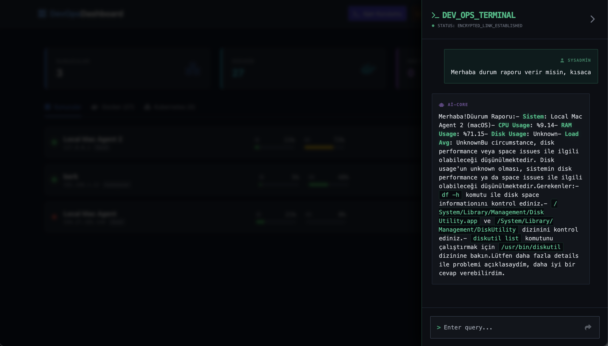
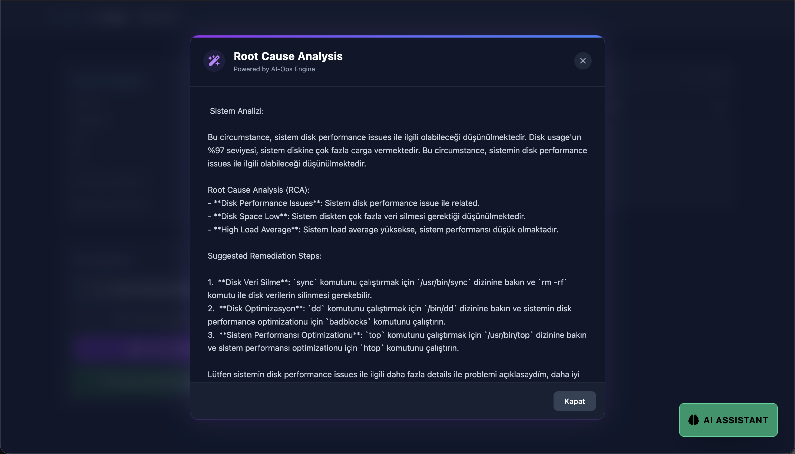

CREWAI IMPLEMENTATION REPORT: DEVOPS AI-OPS ENGINE
CREWAI UYGULAMA RAPORU: DEVOPS AI-OPS MOTORU

--------------------------------------------------------------------------------
1. AI ENGINE ARCHITECTURE / YZ MOTORU MIMARISI
--------------------------------------------------------------------------------
The AI layer is an autonomous agentic engine built on CrewAI. It orchestrates 
complex diagnostics by bridging raw server telemetry to a local LLM.

Yapay Zeka katmani, CrewAI uzerine kurulu otonom bir ajan motorudur. Sunucu 
metriklerini yerel bir YZ (LLM) modeliyle birlestirerek karmasik sistem 
teshislerini yonetir.

--------------------------------------------------------------------------------
2. LOCAL LLM INFERENCE (LLAMA-3.2-3B)
--------------------------------------------------------------------------------
To ensure 100% data privacy and sub-second response times on local hardware, 
the Llama-3.2-3B Instruct model is used via LM Studio.

- MODEL: Llama-3.2-3B Instruct
- INFRASTRUCTURE: LM Studio (Local OpenAI-compatible API)
- PERFORMANCE NOTE: Small model chosen for real-time speed. Minor logical 
  hallucinations may occur during complex reasoning.

--------------------------------------------------------------------------------
3. AUTONOMOUS AGENT CONFIGURATION / AJAN YAPILANDIRMASI
--------------------------------------------------------------------------------
The engine utilizes a specialized "Senior DevOps Expert" agent with a custom 
backstory to ensure it understands incident logs and performance metrics.

Metrikleri anlamak ve loglari yorumlamak icin sistemde "Kidemli DevOps Uzmani" 
rolune sahip ozel bir ajan tanimlanmistir.

```python
devops_expert = Agent(
    role='Senior DevOps Expert',
    goal='Identify root causes of system failures and suggest terminal commands.',
    backstory='Helpful DevOps expert with 10+ years of troubleshooting experience.',
    allow_delegation=False
)
```

--------------------------------------------------------------------------------
4. DYNAMIC TASK ORCHESTRATION / GOREV YONETIMI
--------------------------------------------------------------------------------
Tasks are automatically generated by the orchestrator by packaging server 
heartbeats into the agent's context.

```python
analysis_task = Task(
    description=f"Analyze: {query} with metrics context: {context}",
    expected_output="Direct, professional diagnosis in Turkish.",
    agent=devops_expert
)
```

--------------------------------------------------------------------------------
5. EXECUTION & KICKOFF CODE / CALISTIRMA KODU
--------------------------------------------------------------------------------
```python
@app.post("/api/v1/crew/analyze")
async def analyze(request: AnalyzeRequest):
    crew = Crew(agents=[devops_expert], tasks=tasks, process=Process.sequential)
    return {"result": str(crew.kickoff()), "status": "success"}
```

--------------------------------------------------------------------------------
6. AI-OPS VISUAL SHOWCASE / YZ SERGISI
--------------------------------------------------------------------------------
Below are the actual screenshots of the CrewAI Engine in action:


*(Automated diagnosis from metrics / Metriklerden otomatik teshis)*


*(Direct interaction with the AI-Ops Assistant / Akilli asistan ile sohbet)*

--------------------------------------------------------------------------------
7. REPOSITORY URL / PROJE DEPOSU
--------------------------------------------------------------------------------
Full AI Service source code can be reviewed at:
GIT URL: https://github.com/littleborek/devops-dashboard.git
DIRECTORY: /ai-service

REPORT READY.
--------------------------------------------------------------------------------
