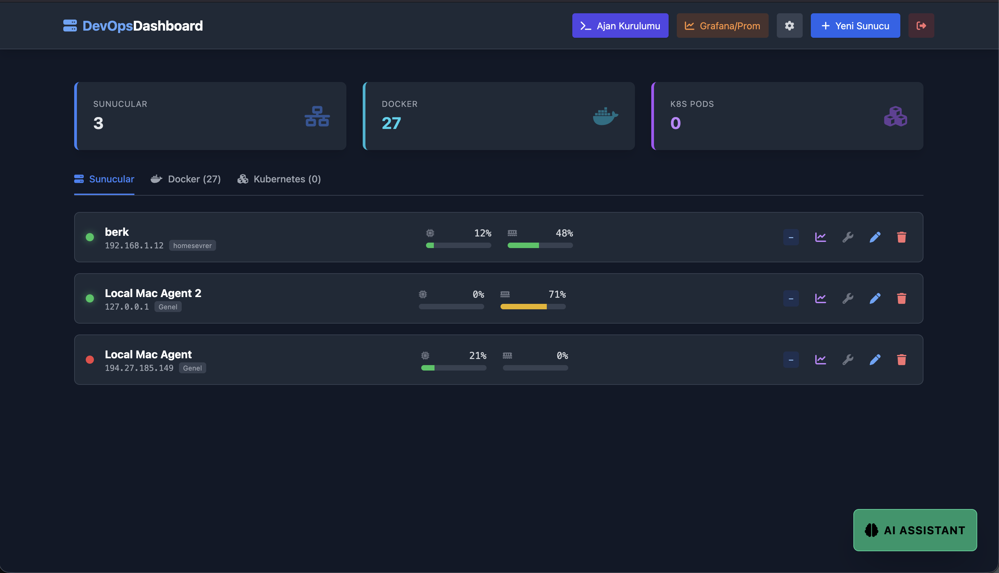
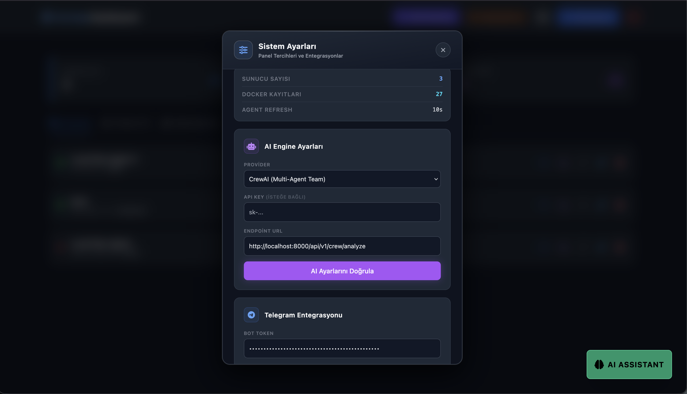

CREWAI IMPLEMENTATION REPORT: DEVOPS AI-OPS ENGINE
CREWAI UYGULAMA RAPORU: DEVOPS AI-OPS MOTORU

--------------------------------------------------------------------------------
1. ARCHITECTURE OVERVIEW / MIMARI GENEL BAKIS
--------------------------------------------------------------------------------
The AI layer is implemented as a Python microservice using FastAPI and CrewAI. 
It connects to a local Llama-3.2-3B Instruct model via LM Studio, ensuring 
data privacy and high-speed local inference.

--------------------------------------------------------------------------------
2. LOGICAL AGENTS / MANTIKSAL AJANLAR
--------------------------------------------------------------------------------
The system utilizes a specialized Senior DevOps Expert agent.
Sistem, "Kidemli DevOps Uzmani" rolune sahip otonom bir ajan kullanir. Bu ajan, 
Spring Boot backend'den gelen sunucu metriklerini ve loglarini analiz ederek 
kok neden tespiti yapar.

--------------------------------------------------------------------------------
3. LLM MODEL LIMITATIONS / MODEL KISITLIMLARI (3.2-3B)
--------------------------------------------------------------------------------
- ENG: Note that since we are testing with the Llama-3.2-3B parameter model for 
maximum speed and low-latency on local hardware, occasional logical errors or 
hallucinations may occur. This is a deliberate trade-off between absolute 
accuracy and sub-second response times.
- TR: Maksimum hiz ve dusuk gecikme icin Llama-3.2-3B parametreli kucuk model 
kullanilmaktadir. Bu sebeple modelin bazen mantiksal hatalar veya tekrarlar 
(hallucination) yapmasi beklenen bir durumdur. Bu durum, donanim kisitlarinda 
gercek zamanli analiz sunabilmek icin yapilmis bir hiz-dogruluk tercihidir.

--------------------------------------------------------------------------------
4. CONFIGURATION (CFG) / YAPILANDIRMA NOTLARI
--------------------------------------------------------------------------------
- mTLS & Security: All endpoints are secured using Mutual TLS (X.509 certificates) 
located in the /certs directory.
- Agent Config: Environment-specific LLM parameters are set in the agents.py file.
- Exclusions: Large dependencies like node_modules and Python venv are excluded 
from the repository for a clean deployment.

--------------------------------------------------------------------------------
5. CODE SNIPPETS / KOD PARCACIKLARI (AGENT & TASK CFG)
--------------------------------------------------------------------------------
```python
# Agent Snippet
devops_expert = Agent(
    role='Senior DevOps Expert',
    goal='Provide concise and actionable DevOps advice in Turkish.',
    backstory='You are a helpful and direct DevOps expert.',
    allow_delegation=False
)

# Task Snippet
analysis_task = Task(
    description="Analyze query with system context.",
    expected_output="Direct response in Turkish.",
    agent=devops_expert
)
```

--------------------------------------------------------------------------------
6. IMPLEMENTATION SHOWCASE / UYGULAMA SERGISI (GÖRSELLER)
--------------------------------------------------------------------------------
Projenin calisma anindan gercek ekran goruntuleri (Rendered in GitHub):






--------------------------------------------------------------------------------
7. PROJECT REPOSITORY / PROJE DEPOSU
--------------------------------------------------------------------------------
Tum kaynak kodlarina asagidaki adresten ulasilabilir:

GIT URL: https://github.com/littleborek/devops-dashboard.git
BRANCH: main

--------------------------------------------------------------------------------
8. ACHIEVEMENTS / KAZANIMLAR
--------------------------------------------------------------------------------
- Local LLM: Zero-cost, private AI with Llama 3.2.
- mTLS: Certified security for all endpoints with X.509.
- RSA Signing: Secure command execution via digital signature.
- Automated RCA: Automated Root Cause Analysis logic.

Report Completed / Rapor Tamamlanmistir.
--------------------------------------------------------------------------------
